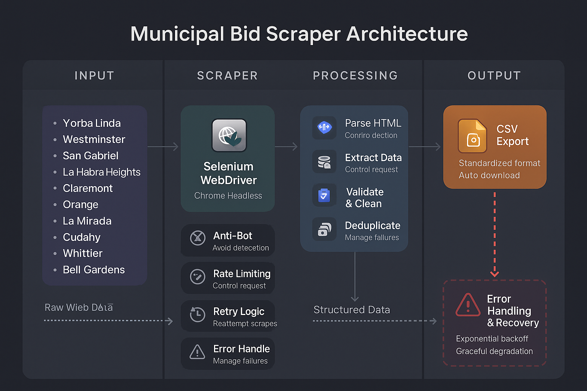

# Municipal Bid Tracker


> Automated procurement opportunity tracking for California municipalities

## Overview

Municipal Bid Tracker is a collection of intelligent web scrapers designed to democratize access to public procurement opportunities. By automating the discovery and aggregation of RFPs, RFQs, and bid announcements across 10 California cities, this tool empowers small businesses and contractors to compete effectively in the public sector marketplace.

## 🎯 Business Impact

- **Levels the playing field** for small contractors who lack resources for manual bid monitoring
- **Reduces opportunity costs** by eliminating daily manual website checks
- **Improves bid participation rates** through timely notification of new opportunities
- **Supports economic development** by connecting local businesses with municipal projects

## 🛠️ Technology Stack

- **Python 3.8+** - Core programming language
- **Selenium WebDriver** - Browser automation and dynamic content handling
- **Pandas** - Data manipulation and CSV export
- **Chrome/Chromium** - Headless browser execution
- **Google Colab** - Cloud-based development and execution environment

## 🏗️ Architecture



## 🏛️ Supported Municipalities

| City | Website Type | Unique Challenges |
|------|-------------|-------------------|
| Yorba Linda | Standard Portal | Category-based organization |
| Westminster | Protected Site | Anti-bot measures, retry logic |
| San Gabriel | Legacy System | Dual content parsing |
| La Habra Heights | Simple Portal | Minimal data structure |
| Claremont | Custom CMS | Non-standard CSS selectors |
| Orange | Filtered Portal | Dropdown state management |
| La Mirada | Hybrid System | Multiple content sections |
| Cudahy | Standard Portal | Category classification |
| Whittier | Enhanced Portal | Department filtering |
| Bell Gardens | Responsive Portal | Mobile-optimized tables |

## ⚡ Key Features

- **Adaptive Architecture** - Each scraper customized for specific site structures
- **Robust Error Handling** - Retry logic and graceful failure management
- **Respectful Scraping** - Rate limiting and robots.txt compliance
- **Data Standardization** - Consistent CSV output across all municipalities
- **Duplicate Prevention** - Intelligent tracking of previously captured bids
- **Real-time Processing** - Immediate CSV download in Colab environment

## 🚀 Quick Start

### Prerequisites
```bash
Python 3.8+
Chrome/Chromium browser
Google Colab (recommended) or local Jupyter environment
```

### Installation
1. Clone the repository:
```bash
git clone https://github.com/yourusername/municipal-bid-tracker.git
cd municipal-bid-tracker
```

2. Open any city scraper in Google Colab or Jupyter:
```bash
jupyter notebook city-bid-scraper-yorba-linda.ipynb
```

3. Run all cells sequentially - the scraper will:
   - Install dependencies automatically
   - Execute the crawling process
   - Generate and download CSV results

## 📊 Sample Output

Each scraper generates standardized CSV files with columns tailored to available data:

```csv
Title,Category,Status,Closing Date,Details URL,Last Updated
"Street Rehabilitation Project",Public Works,Open,2025-03-15,https://...,2025-02-20 10:30:00
"IT Services RFP",Technology,Closed,2025-02-28,https://...,2025-02-20 10:30:00
```

## 📁 Project Structure

```
municipal-bid-tracker/
├── README.md
├── LICENSE
├── scraper_achchitecture.png
├── city-bid-scraper-yorba-linda.ipynb
├── city-bid-scraper-westminster.ipynb
├── city-bid-scraper-san-gabriel.ipynb
├── city-bid-scraper-la-habra-heights.ipynb
├── city-bid-scraper-claremont.ipynb
├── city-bid-scraper-orange.ipynb
├── city-bid-scraper-la-mirada.ipynb
├── city-bid-scraper-cudahy.ipynb
├── city-bid-scraper-whittier.ipynb
└── city-bid-scraper-bell-gardens.ipynb
```

## 🔧 Technical Architecture

### Design Patterns
- **Template Method Pattern** - Consistent scraper lifecycle across cities
- **Strategy Pattern** - City-specific parsing implementations
- **Factory Pattern** - Dynamic driver configuration
- **Observer Pattern** - Progress tracking and logging

### Error Handling
- Exponential backoff retry mechanisms
- Graceful degradation for missing elements
- Comprehensive logging for debugging
- Timeout management for slow-loading pages

### Performance Optimizations
- Headless browser operation
- Intelligent wait strategies
- Memory-efficient data processing
- Minimal DOM traversal

## 🌟 Advanced Features

- **Anti-Detection Measures** - Realistic user agent rotation and timing
- **Dynamic Content Handling** - JavaScript-rendered page support
- **Mobile-Responsive Parsing** - Handles various table structures
- **Filter Management** - Automatic dropdown and checkbox manipulation
- **Data Validation** - Ensures output quality and completeness

## 📈 Scalability Considerations

The modular architecture supports easy extension:
- Add new municipalities by following existing patterns
- Implement notification systems (email, Slack, etc.)
- Create centralized database storage
- Build API endpoints for real-time access
- Develop scheduling for automated execution

## ⚖️ Legal & Ethical Compliance

- **Public Data Only** - Accesses publicly available information
- **Robots.txt Compliance** - Respects website crawling guidelines  
- **Rate Limiting** - Implements delays between requests
- **No Authentication Bypass** - Works only with openly accessible content
- **Terms of Service Adherence** - Operates within acceptable use policies

## 📄 License

This project is licensed under the MIT License - see the [LICENSE](LICENSE) file for details.

## 🙏 Acknowledgments

- Municipal governments for maintaining transparent procurement processes
- Open-source community for excellent tools and libraries
- Selenium project for robust browser automation capabilities

---

**Disclaimer:** This tool is designed for legitimate business purposes to improve access to public procurement opportunities. Users are responsible for ensuring their usage complies with applicable laws and website terms of service.
